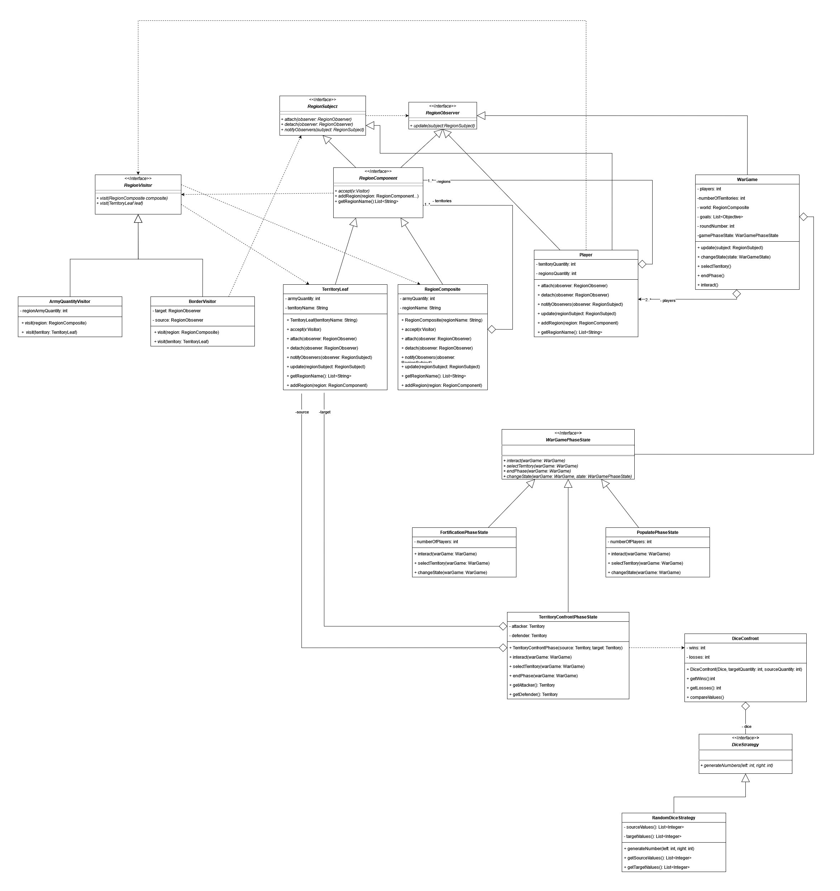

# Diagrama de Classe do escopo Fase de Ataque Entre Territórios

## Padrões de projeto Utilizados:  
- **Observer**
- **Composite**
- **Visitor**
- **Strategy**

|  | 
|:--:| 
| *Diagrama de classe da fase de ataque entre territórios*|